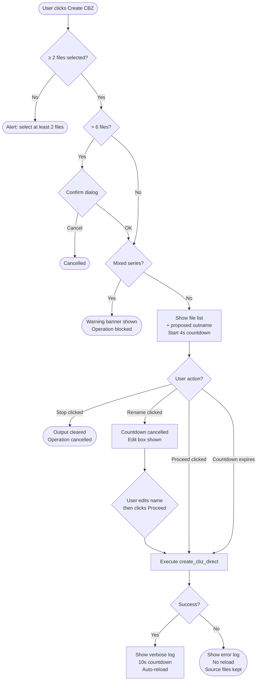
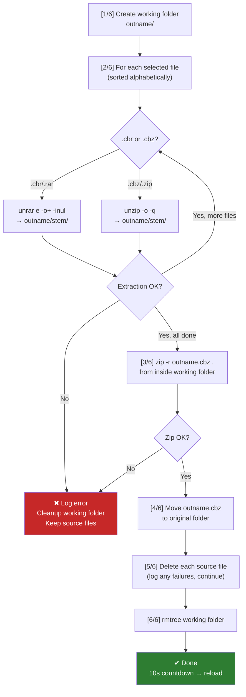
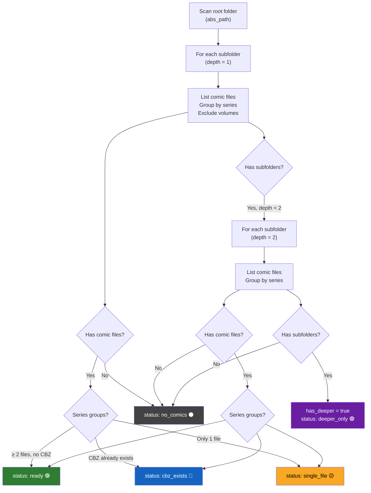
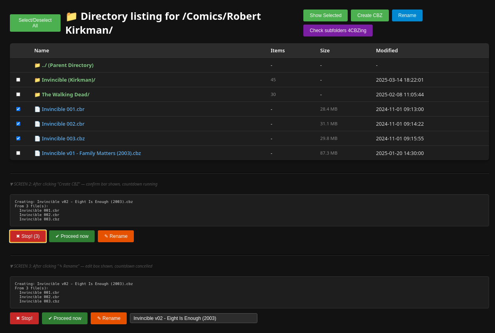
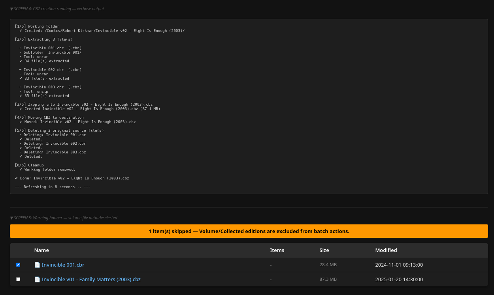
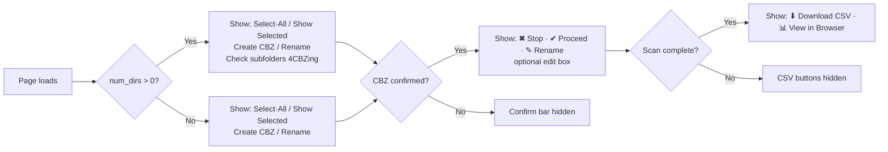

# Comic Archive Browser — Product Requirements
## action_explorer — Feature & Requirements Document

**Prepared by:** Business Analyst / Senior Developer  
**Status:** Current as of v12  
**Platform:** Linux desktop (Kubuntu/Debian), Firefox browser  

---

## 1. Purpose & Context

The user manages a large personal comic book collection stored as `.cbr` and `.cbz` archive files, organised in a folder hierarchy on a local Linux machine.

The primary pain point is **batch conversion**: individual issue files (e.g. 6 `.cbr` files representing issues 1–6 of a series) need to be merged into a single `.cbz` volume archive. Existing tools (`makecbz.py`) work but require terminal use and are prone to errors when many files exist in the same folder (glob patterns match unintended files).

A secondary need is **browsing and housekeeping**: navigating the folder structure, renaming files/folders, and auditing which series are ready to be merged.

The solution is a **self-contained Python web server** that serves a browser UI, accessible at `http://localhost:8123/`. No external web framework, no database, no installation beyond standard Linux tools.

---

## 2. User Roles

Single user (personal tool). No authentication required. No multi-user considerations.

---

## 3. Functional Requirements

### 3.1 Directory Browsing

| ID | Requirement |
|----|-------------|
| BR-01 | The server must serve any directory passed as a command-line argument, defaulting to the current directory |
| BR-02 | The directory listing must display: file/folder name, item count (for folders), file size (auto-scaled), last modified date |
| BR-03 | Folders must be sorted before files; both groups sorted alphabetically case-insensitively |
| BR-04 | Clicking a folder navigates into it; clicking a file serves/downloads it |
| BR-05 | A parent directory (`../`) link must be shown on all pages except the root |
| BR-06 | Folder item counts must show a tooltip with separate file and subfolder counts on hover |

### 3.2 File Selection

| ID | Requirement |
|----|-------------|
| SEL-01 | Each row must have a checkbox for selection |
| SEL-02 | A "Select/Deselect All" button must toggle all **file** checkboxes (not folders) — if any are checked it deselects all; if none are checked it selects all |
| SEL-03 | Selecting a file that matches the volume pattern must automatically deselect it and show a warning banner explaining why |
| SEL-04 | Volume pattern must detect: v1/v01/vol1, TPB, Omnibus, Collection, Graphic Novel, GN, HC, Scanlation, Complete |
| SEL-05 | If no files are explicitly checked when an action is triggered, all eligible non-volume files in the folder are treated as selected (implicit selection fallback) |
| SEL-06 | Rubber-band drag selection: clicking and dragging on the table background must draw a selection rectangle and check all rows it overlaps |
| SEL-07 | Drag selection must not activate when clicking on checkboxes, links, or buttons |
| SEL-08 | Drag selection must auto-scroll the page when the cursor approaches the viewport top or bottom edge |
| SEL-09 | Drag selection must preserve previously checked items outside the drag rectangle |

### 3.3 File & Folder Rename

| ID | Requirement |
|----|-------------|
| REN-01 | A "Rename" button must rename the single selected item (file or folder) |
| REN-02 | Exactly one item must be selected; if zero or more than one are selected, show an error alert |
| REN-03 | A native browser prompt pre-filled with the current name must be shown |
| REN-04 | The page must reload automatically after a successful rename |
| REN-05 | Rename errors (permissions, etc.) must be reported to the user |

### 3.4 CBZ Creation

| ID | Requirement |
|----|-------------|
| CBZ-01 | A "Create CBZ" button must merge the selected comic files into a single `.cbz` archive |
| CBZ-02 | At least 2 files must be selected; if fewer, show an error alert |
| CBZ-03 | If more than 6 files are selected, a confirmation dialog must ask the user to confirm before proceeding |
| CBZ-04 | If selected files belong to more than one detected series, show a warning and block creation |
| CBZ-05 | The proposed output filename must be derived from the first selected file: series name + next available volume number + subtitle (if present) + year (if present) |
| CBZ-06 | The volume number must be auto-detected by scanning existing `.cbz` files in the current folder — if `v01` and `v02` exist, suggest `v03` |
| CBZ-07 | Volume number must be zero-padded to 2 digits (v01, v02 … v10, v11) |
| CBZ-08 | Output filename format: `{Series} {vNN} - {Subtitle} ({Year})` — subtitle and year are optional |
| CBZ-09 | After clicking Create CBZ, the proposed output name and file list must be shown before execution begins |
| CBZ-10 | A countdown of 4 seconds must begin automatically; if not interrupted the operation proceeds |
| CBZ-11 | A "✖ Stop!" button must cancel the operation at any point before execution starts; the countdown remaining seconds must be shown on the button |
| CBZ-12 | A "✔ Proceed now" button must execute immediately without waiting for the countdown |
| CBZ-13 | A "✎ Rename" button must reveal an editable text field pre-filled with the proposed output name |
| CBZ-14 | Clicking Rename must immediately cancel the countdown — the user must click Proceed manually after editing |
| CBZ-15 | If the Rename field is visible and non-empty when Proceed is clicked, its value must be used as the output name |

#### CBZ Creation — User Interaction Flow



### 3.5 CBZ Creation — Technical Process

| ID | Requirement |
|----|-------------|
| CBZ-T01 | Only the explicitly selected files must be processed — no glob patterns |
| CBZ-T02 | A temporary working folder named after the output file must be created in the current directory |
| CBZ-T03 | Each source file must be extracted into its own named subfolder within the working folder, preserving alphabetical order for correct page sequencing |
| CBZ-T04 | `.cbr` files must be extracted using `unrar` (supports RAR5) |
| CBZ-T05 | `.cbz` files must be extracted using `unzip` |
| CBZ-T06 | The working folder must be zipped using `zip -r` to produce the final `.cbz` |
| CBZ-T07 | The resulting `.cbz` must be moved from the working folder to the original folder |
| CBZ-T08 | Source files must be deleted after successful CBZ creation only — never on failure |
| CBZ-T09 | The working folder must be deleted after successful completion |
| CBZ-T10 | On failure at any step: log the error, attempt cleanup of the working folder, do not delete source files |

#### CBZ Creation — Technical Steps



### 3.6 Execution Output

| ID | Requirement |
|----|-------------|
| OUT-01 | A terminal-style output panel must be shown during and after CBZ creation |
| OUT-02 | Output must be verbose and structured with step markers (`[1/6]`, `[2/6]` etc.) |
| OUT-03 | Each action within a step must be prefixed: `✔` for success, `✖` for failure, `·` for informational |
| OUT-04 | After successful completion, the output must remain visible for 10 seconds before the page auto-reloads |
| OUT-05 | A live countdown must be shown in the output panel during the 10-second delay |
| OUT-06 | On failure, the output must remain visible indefinitely (no auto-reload) |
| OUT-07 | The output panel must auto-scroll to the bottom as new lines appear |

### 3.7 Subfolder CBZ Audit ("Check subfolders 4CBZing")

| ID | Requirement |
|----|-------------|
| AUD-01 | A "Check subfolders 4CBZing" button must appear in the header only when the current folder contains at least one subfolder |
| AUD-02 | Clicking it must scan subfolders up to 2 levels deep |
| AUD-03 | For each subfolder, comic files must be grouped by detected series name |
| AUD-04 | Volume files (matching the volume pattern) must be excluded from grouping and counted separately |
| AUD-05 | Each group must be assigned a status: `ready` (≥2 files, no CBZ exists), `cbz_exists`, `single_file`, `no_comics`, `deeper_only` |
| AUD-06 | Folders at depth 2 that contain further subfolders must be flagged with `has_deeper_subfolders = true` |
| AUD-07 | Results must be written to a CSV file named `{current_folder_name}_checked.csv` in the current directory |
| AUD-08 | CSV columns: `path`, `series`, `file_count`, `volumes_skipped`, `status`, `proposed_outname`, `has_deeper_subfolders`, `files` |
| AUD-09 | A summary of counts per status must be shown in the output panel after scanning |
| AUD-10 | Two buttons must appear after scanning: "⬇ Download CSV" and "📊 View in Browser" |

#### Subfolder Scan — Decision Tree



### 3.8 CSV Viewer

| ID | Requirement |
|----|-------------|
| CSV-01 | The CSV must be viewable as a styled HTML page at `/view_csv?file=<path>` |
| CSV-02 | The viewer must use the same dark theme as the main browser |
| CSV-03 | Summary pill badges must show counts per status at the top of the page |
| CSV-04 | Filter buttons must allow showing only rows of a specific status |
| CSV-05 | All columns must be sortable by clicking the column header (toggle asc/desc); numeric columns must sort numerically |
| CSV-06 | Status column must show a colour-coded badge |
| CSV-07 | Path column must be a clickable link that opens the folder in the file browser in a new tab |
| CSV-08 | Series column must show the series name plus a smaller grey link below it pointing to `{path}/{series}/` — Ctrl+click opens that subfolder in a new tab |
| CSV-09 | A `← Back` link must return to the previous page |

---

## 4. Filename Parsing Requirements

| ID | Requirement |
|----|-------------|
| FP-01 | The parser must extract: series name, subtitle, year from standard comic naming conventions |
| FP-02 | Standard format supported: `{Series} {issue} (of {total}) - {Subtitle} ({Year}) ({Tag})...ext` |
| FP-03 | Issue number formats supported: `01`, `#01`, `01 (of 05)`, `#01 (of 05)`, `(001)` (1–3 digit number in parentheses) |
| FP-04 | Publisher/quality tags in parentheses (e.g. `(Digital)`, `(Zone-Empire)`) must be stripped from subtitle |
| FP-05 | Year must be a 4-digit number in parentheses e.g. `(2025)` |
| FP-06 | Parser must be implemented identically in both Python (server) and JavaScript (client) |

#### Filename Parsing — Examples

```
Input:  "The Cold Witch 01 (of 05) - A Tale of the Shrouded College (2025) (Digital) (Zone-Empire).cbr"

        ┌─────────────────┐  ┌──┐  ┌──────┐  ┌───────────────────────────────────────┐  ┌────┐
        │  The Cold Witch  │  │01│  │of 05 │  │   A Tale of the Shrouded College       │  │2025│
        └────────┬─────────┘  └──┘  └──────┘  └──────────────────┬────────────────────┘  └─┬──┘
                 │            issue   total                        │                         │
                 ▼                                                 ▼                         ▼
              series                                           subtitle                     year
                 │                                                 │                         │
                 └─────────────────────────────┬───────────────────┘                         │
                                               ▼                                             │
                              "The Cold Witch v03 - A Tale of the Shrouded College (2025)"  ◄┘
                               (v03 = next available after scanning existing .cbz files)

Input:  "3W3M (001) - Fable (2021) (digital-Empire).cbr"   ← parenthesised issue number

        ┌──────┐  ┌─────┐  ┌─────┐  ┌────┐
        │ 3W3M │  │(001)│  │Fable│  │2021│
        └──┬───┘  └──┬──┘  └──┬──┘  └─┬──┘
           │       issue    subtitle   year
           ▼                   │         │
        series                 │         │
           └───────────────────┴────┬────┘
                                    ▼
                          "3W3M v01 - Fable (2021)"
```

---

## 5. Scroll Restoration

| ID | Requirement |
|----|-------------|
| SCR-01 | When navigating into a subfolder and pressing Back, the parent listing must scroll to the folder that was clicked |
| SCR-02 | The restored row must be highlighted with a yellow flash animation for 2 seconds |
| SCR-03 | Scroll position must be stored in `sessionStorage` keyed by pathname |

---

## 6. Non-Functional Requirements

| ID | Requirement |
|----|-------------|
| NFR-01 | No external Python packages — stdlib only |
| NFR-02 | System dependencies: `unrar`, `unzip`, `zip` |
| NFR-03 | Python 3.10+ required |
| NFR-04 | Server must handle `KeyboardInterrupt` gracefully and call `server_close()` |
| NFR-05 | Subprocess calls must use `cwd=` parameter, never `os.chdir()`, to avoid thread-safety issues |
| NFR-06 | The entire application must be a single `.py` file — no templates, no static assets |
| NFR-07 | The UI must be usable in Firefox on Linux; no browser-specific APIs beyond standard DOM |
| NFR-08 | Dark theme throughout — background `#121212`, text `#e0e0e0`, no white pages |

---

## 7. UI Design

### 7.1 Main Directory Browser

The mockup below is a functional HTML preview. Open `action_explorer_mockup.html` in Firefox to view it rendered, or view the source below.

> **Note:** All buttons and links in the mockup are non-functional — layout and styling only.

<details>
<summary>📐 Click to expand HTML mockup source</summary>

```html
<!DOCTYPE HTML>
<html>
<head>
<meta charset="utf-8">
<title>UI Mockup — action_explorer</title>
<style>
  body { font-family: "Segoe UI", Roboto, sans-serif; margin: 2rem;
         background: #121212; color: #e0e0e0; }
  h1 { color: #fff; margin: 0; }
  table { width: 100%; border-collapse: collapse; background: #1e1e1e;
          border-radius: 8px; overflow: hidden; box-shadow: 0 4px 6px rgba(0,0,0,0.3); }
  th, td { padding: 12px 16px; text-align: left; border-bottom: 1px solid #333; }
  th { background: #2c2c2c; font-weight: 600; color: #fff; }
  tr:last-child td { border-bottom: none; }
  tr:hover { background: #2a2a2a; }
  a { color: #64b5f6; text-decoration: none; font-weight: 500; display: block; }
  .dir { color: #81c784; font-weight: bold; }
  .btn { border: none; color: white; padding: 10px 20px; cursor: pointer;
         border-radius: 4px; font-size: 15px; }
  .green  { background: #4CAF50; } .blue   { background: #0288d1; }
  .purple { background: #7b1fa2; } .red    { background: #c62828; }
  .dkgreen{ background: #2e7d32; } .orange { background: #e65100; }
  .header-container { display: flex; justify-content: space-between;
                      align-items: center; margin-bottom: 20px; }
  .btn-group { display: flex; gap: 10px; flex-wrap: wrap; }
  .warning { background: #ff9800; color: #000; padding: 10px; margin-bottom: 16px;
             border-radius: 4px; font-weight: bold; text-align: center; }
  .output { background: #1e1e1e; color: #d4d4d4; padding: 15px; margin-top: 24px;
            font-family: monospace; border-radius: 5px; border: 1px solid #333;
            white-space: pre; font-size: 0.9em; }
  .confirm-bar { display: flex; gap: 10px; margin-top: 12px; align-items: center;
                 flex-wrap: wrap; }
  input[type=text] { background: #2c2c2c; color: #fff; border: 1px solid #555;
                     border-radius: 4px; padding: 6px 10px; font-size: 0.95em;
                     width: 380px; }
  .size  { color: #888; font-size: 0.9em; }
  .count { color: #888; font-size: 0.9em; }
  .note  { color: #555; font-size: 0.8em; font-style: italic; margin-top: 24px; }
</style>
</head>
<body>

<!-- ═══════════════════════════════════════════
     SCREEN 1: Normal directory listing
     ═══════════════════════════════════════════ -->

<div class="header-container">
  <div style="display:flex;align-items:center;gap:15px">
    <button class="btn green">Select/Deselect All</button>
    <h1>📁 Directory listing for /Comics/Robert Kirkman/</h1>
  </div>
  <div class="btn-group">
    <button class="btn green">Show Selected</button>
    <button class="btn green">Create CBZ</button>
    <button class="btn blue">Rename</button>
    <button class="btn purple">Check subfolders 4CBZing</button>
  </div>
</div>

<table>
  <tr>
    <th style="width:30px"></th>
    <th>Name</th><th>Items</th><th>Size</th><th>Modified</th>
  </tr>
  <tr>
    <td></td>
    <td><a href="#" class="dir">📁 ../ (Parent Directory)</a></td>
    <td>-</td><td>-</td><td>-</td>
  </tr>
  <tr>
    <td><input type="checkbox"></td>
    <td><a href="#" class="dir">📁 Invincible (Kirkman)/</a></td>
    <td class="count" title="42 file(s), 3 folder(s)">45</td>
    <td>-</td><td>2025-03-14 18:22:01</td>
  </tr>
  <tr>
    <td><input type="checkbox"></td>
    <td><a href="#" class="dir">📁 The Walking Dead/</a></td>
    <td class="count" title="30 file(s), 0 folder(s)">30</td>
    <td>-</td><td>2025-02-08 11:05:44</td>
  </tr>
  <tr>
    <td><input type="checkbox" checked></td>
    <td><a href="#">📄 Invincible 001.cbr</a></td>
    <td>-</td><td class="size">28.4 MB</td><td>2024-11-01 09:13:00</td>
  </tr>
  <tr>
    <td><input type="checkbox" checked></td>
    <td><a href="#">📄 Invincible 002.cbr</a></td>
    <td>-</td><td class="size">31.1 MB</td><td>2024-11-01 09:14:22</td>
  </tr>
  <tr>
    <td><input type="checkbox" checked></td>
    <td><a href="#">📄 Invincible 003.cbz</a></td>
    <td>-</td><td class="size">29.8 MB</td><td>2024-11-01 09:15:55</td>
  </tr>
  <tr>
    <td><input type="checkbox"></td>
    <td><a href="#">📄 Invincible v01 - Family Matters (2003).cbz</a></td>
    <td>-</td><td class="size">87.3 MB</td><td>2025-01-20 14:30:00</td>
  </tr>
</table>

<hr style="border-color:#333;margin:40px 0 20px">

<!-- ═══════════════════════════════════════════
     SCREEN 2: After clicking Create CBZ —
     confirm bar with countdown visible
     ═══════════════════════════════════════════ -->

<p class="note">▼ SCREEN 2: After clicking "Create CBZ" — confirm bar shown, countdown running</p>

<div class="output">Creating: Invincible v02 - Eight Is Enough (2003).cbz
From 3 file(s):
  Invincible 001.cbr
  Invincible 002.cbr
  Invincible 003.cbz
</div>

<div class="confirm-bar">
  <button class="btn red">✖ Stop! (3)</button>
  <button class="btn dkgreen">✔ Proceed now</button>
  <button class="btn orange">✎ Rename</button>
  <input type="text" value="Invincible v02 - Eight Is Enough (2003)" style="display:none">
</div>

<hr style="border-color:#333;margin:40px 0 20px">

<!-- ═══════════════════════════════════════════
     SCREEN 3: Rename box opened,
     countdown cancelled
     ═══════════════════════════════════════════ -->

<p class="note">▼ SCREEN 3: After clicking "✎ Rename" — edit box shown, countdown cancelled</p>

<div class="output">Creating: Invincible v02 - Eight Is Enough (2003).cbz
From 3 file(s):
  Invincible 001.cbr
  Invincible 002.cbr
  Invincible 003.cbz
</div>

<div class="confirm-bar">
  <button class="btn red">✖ Stop!</button>
  <button class="btn dkgreen">✔ Proceed now</button>
  <button class="btn orange">✎ Rename</button>
  <input type="text" value="Invincible v02 - Eight Is Enough (2003)">
</div>

<hr style="border-color:#333;margin:40px 0 20px">

<!-- ═══════════════════════════════════════════
     SCREEN 4: Execution output — in progress
     ═══════════════════════════════════════════ -->

<p class="note">▼ SCREEN 4: CBZ creation running — verbose output</p>

<div class="output">[1/6] Working folder
  ✔ Created: /Comics/Robert Kirkman/Invincible v02 - Eight Is Enough (2003)/

[2/6] Extracting 3 file(s)

  → Invincible 001.cbr  (.cbr)
  · Subfolder: Invincible 001/
  · Tool: unrar
  ✔ 34 file(s) extracted

  → Invincible 002.cbr  (.cbr)
  · Tool: unrar
  ✔ 33 file(s) extracted

  → Invincible 003.cbz  (.cbz)
  · Tool: unzip
  ✔ 35 file(s) extracted

[3/6] Zipping into Invincible v02 - Eight Is Enough (2003).cbz
  ✔ Created Invincible v02 - Eight Is Enough (2003).cbz (87.1 MB)

[4/6] Moving CBZ to destination
  ✔ Moved: Invincible v02 - Eight Is Enough (2003).cbz

[5/6] Deleting 3 original source file(s)
  · Deleting: Invincible 001.cbr
  ✔ Deleted.
  · Deleting: Invincible 002.cbr
  ✔ Deleted.
  · Deleting: Invincible 003.cbz
  ✔ Deleted.

[6/6] Cleanup
  ✔ Working folder removed.

✔ Done: Invincible v02 - Eight Is Enough (2003).cbz

--- Refreshing in 8 seconds... ---</div>

<hr style="border-color:#333;margin:40px 0 20px">

<!-- ═══════════════════════════════════════════
     SCREEN 5: Volume warning banner
     ═══════════════════════════════════════════ -->

<p class="note">▼ SCREEN 5: Warning banner — volume file auto-deselected</p>

<div class="warning">1 item(s) skipped — Volume/Collected editions are excluded from batch actions.</div>

<table>
  <tr>
    <th style="width:30px"></th><th>Name</th><th>Items</th><th>Size</th><th>Modified</th>
  </tr>
  <tr>
    <td><input type="checkbox" checked></td>
    <td><a href="#">📄 Invincible 001.cbr</a></td>
    <td>-</td><td class="size">28.4 MB</td><td>2024-11-01 09:13:00</td>
  </tr>
  <tr>
    <td><input type="checkbox"></td>
    <td><a href="#">📄 Invincible v01 - Family Matters (2003).cbz</a></td>
    <td>-</td><td class="size">87.3 MB</td><td>2025-01-20 14:30:00</td>
  </tr>
</table>

</body>
</html>
```

</details>

### Mocked design screenshots:



### 7.2 UI Layout — Header Button Visibility Rules



---

## 8. Out of Scope

- Multi-user access or authentication
- Editing image content inside archives
- Uploading files via the browser
- Sorting/renaming pages within a CBZ
- Integration with any comic reading application
- Windows or macOS support (Linux only)
- Mobile/touch device support

---

## 9. Glossary

| Term | Definition |
|------|------------|
| CBZ | Comic Book ZIP — a ZIP archive containing image files, standard comic format |
| CBR | Comic Book RAR — a RAR archive containing image files |
| RAR5 | Newer RAR compression format; requires `unrar`, not supported by `p7zip` |
| Volume | A collected edition of multiple issues, identified by naming patterns like `v01`, `TPB`, `Omnibus` |
| Series | The title of a comic series, parsed from the filename before the issue number |
| Outname | The proposed output filename for a new CBZ (without extension) |
| Rubber-band selection | Click-and-drag selection rectangle, common in file managers |
| Implicit selection | When no checkboxes are ticked, all eligible files are treated as selected |
